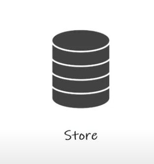
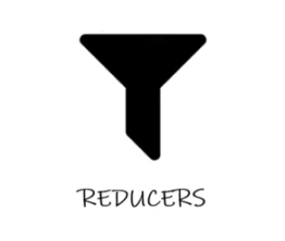
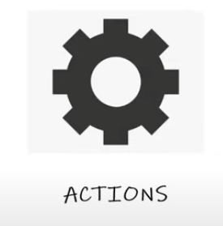

# Redux
A predictable state Container for JS Apps
One single place to **store** info
For larger applications to manage information
State Globally available for our app
Introduces A lot of code

    Store
    Provider
    Reducer
    Action

Tambien usamos:

    Middleware: thunk
    Hooks: UseDispatch, use Selector

## Elements in Redux

### Store
Common place for our app state


### Reducers
Directly manipulating or changing/updating  the state of our app
Takes an *action* with the current state and returns a new state



### Actions
To describe something that happen to our application.
Tell the reducer what to do and how to manipulate the state


    Estructure
```const someAction =
    {
        type: 'PERFORM_TASK',
        payload: 'Learn Redux' //Data
    }
```


```npm install redux
```
